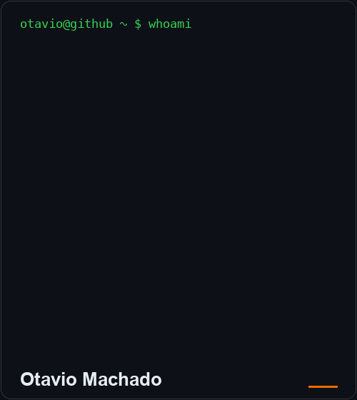
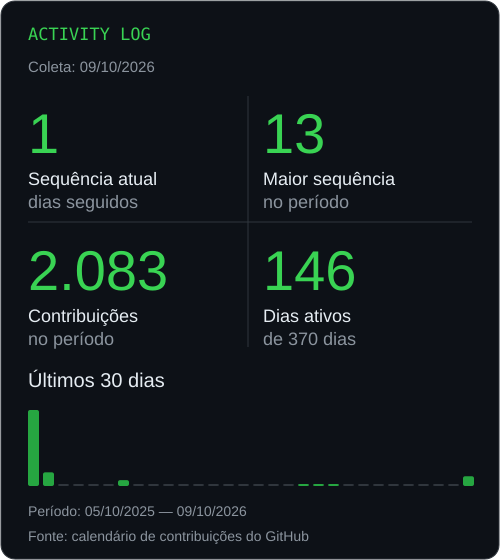

### `otavio@github ~ $ ./contribuicoes`

<picture>
  <source media="(prefers-reduced-motion: reduce)" srcset="assets/contributions-static.svg">
  
</picture>

### `otavio@github ~ $ whoami`

<picture>
  <source media="(prefers-reduced-motion: reduce)" srcset="assets/portrait-terminal-static.png">
  
</picture>

**IA · automação · infraestrutura**

Construindo ferramentas, testando ideias e aprendendo no caminho.

[Explorar minhas contribuições](https://github.com/Otavio-Machado-Santos?tab=overview) · [Ver meus commits públicos](https://github.com/search?q=author%3AOtavio-Machado-Santos&type=commits)

<strong>Últimos commits nos projetos públicos</strong>

<!-- public-commits:start -->

- **16/09/2026 · royal-mcp:** [ci: use Node 24 checkout action](https://github.com/Otavio-Machado-Santos/royal-mcp/commit/4d38269057edcaca5f99d1191d265b73370bc6f5) · `4d38269`
- **16/09/2026 · royal-mcp:** [feat: publish sanitized Royal MCP trust boundary](https://github.com/Otavio-Machado-Santos/royal-mcp/commit/1cb71e444fb6f3cde11486207c80325fa2ebc259) · `1cb71e4`
- **11/06/2026 · Organizer_brain:** [Merge pull request #1 from Otavio-Machado-Santos/feat/projetos-e-captura-por-voz](https://github.com/Otavio-Machado-Santos/Organizer_brain/commit/17cc72e89fd617481266bec823640d1f77901958) · `17cc72e`
- **11/06/2026 · Organizer_brain:** [feat: projetos, captura por voz (fn+M) e relatório combinando GitHub + tasks](https://github.com/Otavio-Machado-Santos/Organizer_brain/commit/fd49cb9a0fc25901cea448f68cd3375f3fb78767) · `fd49cb9`

Últimos commits de minha autoria nas branches padrão dos projetos públicos, excluindo este README. Coleta: 09/10/2026.

<!-- public-commits:end -->

Dados reais do calendário do GitHub, com data de coleta visível. As sequências são calculadas dentro do período exibido. [Atualizar os dados](scripts/README.md).

[X · @Machadokkj](https://x.com/Machadokkj)

Araraquara/SP · Brasil

## Sobre mim

Gosto de transformar problemas em ferramentas que funcionam. Construo projetos com **IA, automação e infraestrutura**, de agentes e integrações a dashboards e aplicações desktop.

Uso **Python, Rust, TypeScript, Zabbix, Grafana, n8n e LLMs** para explorar ideias e melhorar operações. Compartilho os projetos aqui e o processo no [X](https://x.com/Machadokkj).

## Tecnologias

| Área | Ferramentas |
| :--- | :--- |
| Observabilidade | Zabbix, Grafana, Prometheus |
| Automação e IA | Python, n8n, LangChain, LLMs, Shell, PowerShell |
| DevOps e infraestrutura | Docker, Kubernetes, Linux, Proxmox, VMware, Nginx, AWS, Azure |
| Desenvolvimento e dados | Rust, TypeScript, JavaScript, React, Tauri, MySQL, PostgreSQL, MariaDB |

## Projetos em destaque

### [Royal MCP](https://github.com/Otavio-Machado-Santos/royal-mcp)

Fronteira de confiança para operar hosts SSH a partir de inventários do Royal TS/TSX, com isolamento de credenciais.

`Rust` · `MCP` · `SSH`

### [Monitoramento de OLTs VSOL](https://github.com/Otavio-Machado-Santos/Scripts-Olt-Vsol-Cpu-Temp-SSH)

Scripts para coletar temperatura de CPU por SSH e integrar os dados ao monitoramento do Zabbix.

`Python` · `Zabbix` · `SSH`

### [Agente LangChain + Groq](https://github.com/Otavio-Machado-Santos/agentLangchainGroqV1)

Agente conversacional com consultas dinâmicas sobre dados de incidentes em tempo real.

`Python` · `LangChain` · `Groq`

<strong>Outros trabalhos em observabilidade e IA</strong>

- **NOC AI Dashboard:** Zabbix, Grafana e LLMs para análise de incidentes, com automações em n8n e painéis customizados.
- **GrafanaAI Studio:** aplicação desktop com Tauri, Rust, React e TypeScript para edição assistida de dashboards, com credenciais isoladas por projeto.
- **AI NOC Copilot:** agente conversacional em n8n e LangChain sobre uma base de incidentes ativos.

## Certificações

- **Linux Essentials** — Linux Professional Institute (LPI), novembro de 2024.
- **Tuning em Zabbix** — 2024.

---

**Ideias em construção. Código e progresso por aqui.**

[X](https://x.com/Machadokkj) · [LinkedIn](https://linkedin.com/in/ot%C3%A1vio-machado-santos) · [otaviomachado2003@gmail.com](mailto:otaviomachado2003@gmail.com)

