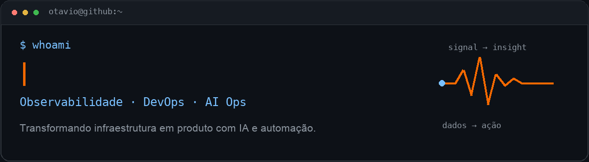
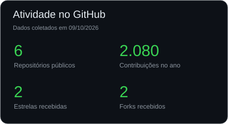
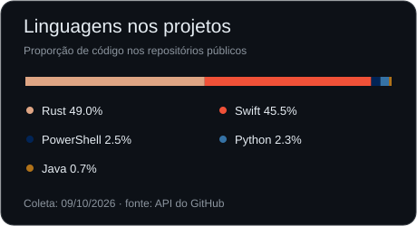
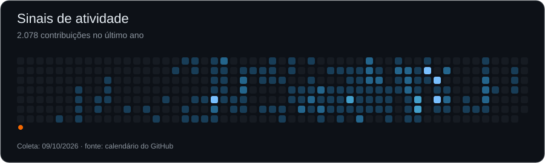

<picture>
  <source media="(prefers-reduced-motion: reduce)" srcset="assets/header-static.png">
  
</picture>

**Analista de Observabilidade Pleno · DevOps e automação · AI Ops**

Araraquara/SP · Brasil · [Flowbix](https://flowbix.com.br)

## Sobre mim

Atuo na **Flowbix desde 2022**, conectando observabilidade, automação e inteligência artificial em ambientes de infraestrutura. Integro **Zabbix, Grafana, Python, n8n e LLMs** para transformar alertas em contexto e apoiar as operações.

Minha visão de produto aplicada à infraestrutura aparece em dashboards de NOC, pipelines de automação e ferramentas para operar sistemas com mais clareza. Tenho interesse especial em **IA aplicada às operações**, com isolamento de credenciais e atenção ao ambiente real.

Aberto a **freelas, oportunidades CLT/PJ e colaborações** em observabilidade, automação e AI Ops.

## Tecnologias

| Área | Ferramentas |
| :--- | :--- |
| Observabilidade | Zabbix, Grafana, Prometheus |
| Automação e IA | Python, n8n, LangChain, LLMs, Shell, PowerShell |
| DevOps e infraestrutura | Docker, Kubernetes, Linux, Proxmox, VMware, Nginx, AWS, Azure |
| Desenvolvimento e dados | Rust, TypeScript, JavaScript, React, Tauri, MySQL, PostgreSQL, MariaDB |

## Projetos em destaque

### [Royal MCP](https://github.com/Otavio-Machado-Santos/royal-mcp)

Fronteira de confiança para operar hosts SSH a partir de inventários do Royal TS/TSX, com isolamento de credenciais.

`Rust` · `MCP` · `SSH`

### [Monitoramento de OLTs VSOL](https://github.com/Otavio-Machado-Santos/Scripts-Olt-Vsol-Cpu-Temp-SSH)

Scripts para coletar temperatura de CPU por SSH e integrar os dados ao monitoramento do Zabbix.

`Python` · `Zabbix` · `SSH`

### [Agente LangChain + Groq](https://github.com/Otavio-Machado-Santos/agentLangchainGroqV1)

Agente conversacional com consultas dinâmicas sobre dados de incidentes em tempo real.

`Python` · `LangChain` · `Groq`

<strong>Outros trabalhos em observabilidade e IA</strong>

- **NOC AI Dashboard:** Zabbix, Grafana e LLMs para análise de incidentes, com automações em n8n e painéis customizados.
- **GrafanaAI Studio:** aplicação desktop com Tauri, Rust, React e TypeScript para edição assistida de dashboards, com credenciais isoladas por projeto.
- **Flowbix AI NOC Copilot:** agente conversacional em n8n e LangChain sobre uma base de incidentes ativos.

## Atividade no GitHub

  
  

<picture>
  <source media="(prefers-reduced-motion: reduce)" srcset="assets/contributions-static.svg">
  
</picture>

A data de coleta aparece em cada gráfico. As linguagens refletem o código dos repositórios públicos; os cards podem ser atualizados pelo [script do perfil](scripts/README.md).

## Certificações

- **Linux Essentials** — Linux Professional Institute (LPI), novembro de 2024.
- **Tuning em Zabbix** — Flowbix, 2024.

---

**Vamos conversar sobre observabilidade, automação e IA?**

[LinkedIn](https://linkedin.com/in/ot%C3%A1vio-machado-santos) · [otaviomachado2003@gmail.com](mailto:otaviomachado2003@gmail.com)

